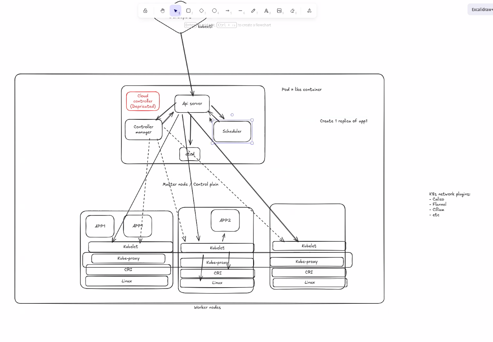

# Документація про Kubernetes Cluster (кластер)

## Що таке кластер
Kubernetes Cluster — це **набір машин (Nodes) + керуючі компоненти**, які разом запускають і підтримують ваші застосунки (Pods).

Простими словами:
- **Control plane** вирішує *що має бути запущено* і *де*.
- **Worker nodes** реально *запускають контейнери*.

## З чого складається кластер
### Control plane ("master" у старій термінології)
Типові компоненти:
- **API Server** — точка входу (kubectl / API), приймає та валідовує запити.
- **etcd** — база даних стану кластера.
- **Scheduler** — обирає Node для Pod’ів.
- **Controller Manager** — контролери, які приводять фактичний стан до бажаного (Deployment/ReplicaSet/Job тощо).

У хмарних середовищах також часто є:
- **Cloud Controller Manager** — інтеграція з хмарним провайдером (LoadBalancer, маршрути, диски тощо). У managed-кластерах це може бути частиною керованого control plane.

### Worker nodes
Типові компоненти на кожній ноді:
- **kubelet** — агент, який отримує PodSpec і запускає/моніторить контейнери.
- **container runtime** — containerd/CRI-O (створює контейнери).
- **мережа** — CNI плагін + kube-proxy (або інший dataplane) для Service.

## Схема (скріншот)
.

## Як проходить шлях "від YAML до працюючого контейнера"
1) Ви робите `kubectl apply -f ...` → об’єкт з’являється в **API Server**.
2) Контролери (наприклад, Deployment) створюють потрібні Pod’и.
3) Scheduler призначає Pod на конкретну **Node**.
4) kubelet на Node створює Pod sandbox (мережа/volumes) і запускає `initContainers` → `containers`.

## Коли “створюється” кластер
Залежить від типу:
- **Managed Kubernetes (AKS/EKS/GKE)**: ви створюєте кластер і node pool — провайдер піднімає control plane та VM для нод.
- **Self-managed**: ви самі розгортаєте control plane та приєднуєте worker-ноди (наприклад, через `kubeadm`).

## Корисні команди kubectl
- Інфо про кластер/контекст: `kubectl cluster-info`
- Перевірити компоненти та їх стан: `kubectl get nodes` (готовність нод)
- Подивитись поточний контекст: `kubectl config current-context`
- Список namespace: `kubectl get ns`

## Пов’язані файли
- Node: [node-doc.md](node-doc.md)
- Containers: [containers-doc.md](containers-doc.md)
- Pod: [pod-doc.md](pod-doc.md)
- Namespace: [namespace-doc.md](namespace-doc.md)
- Service: [service-doc.md](service-doc.md)

## Додатково
- Cluster architecture: https://kubernetes.io/docs/concepts/architecture/
