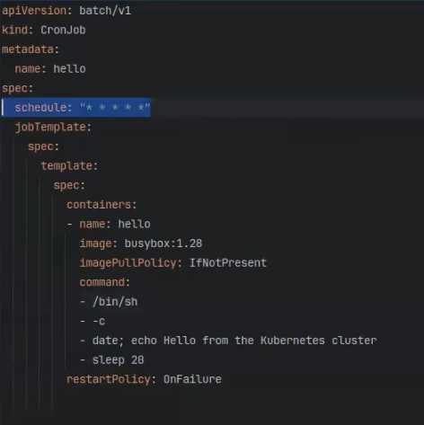

# CronJob

**CronJob** — це запуск **Job за розкладом** (cron-формат). CronJob **не запускає Pod напряму**: він створює **Job**, а Job вже створює **Pod**.

Типові кейси:
- регулярні бек-апи БД
- періодичні синхронізації
- чистка тимчасових даних (cleanup)
- звіти/агрегації за розкладом

## Приклад (як на скріні)



## Як це працює

1) Ти створюєш `CronJob` з `spec.schedule`.
2) У момент “тіку” (за розкладом) CronJob створює **Job**.
3) Job створює **Pod** і виконує задачу.

## Ключові поля CronJob

- `spec.schedule`: cron-розклад (наприклад, `*/5 * * * *`).
- `spec.jobTemplate`: шаблон Job, який буде створюватись.
- `spec.concurrencyPolicy`:
  - `Allow` (default) — дозволяє паралельні запускі
  - `Forbid` — не стартує новий запуск, якщо попередній ще працює
  - `Replace` — зупиняє попередній Job і запускає новий
- `spec.startingDeadlineSeconds`: скільки часу можна “запізнитись” і все ще стартувати Job.
- `spec.suspend`: `true` — тимчасово вимкнути запуск.
- `successfulJobsHistoryLimit` / `failedJobsHistoryLimit`: скільки завершених Job-ів зберігати.

> Примітка: таймзона для cron залежить від налаштувань кластера; у новіших версіях Kubernetes може бути поле `spec.timeZone` (якщо потрібно — скажи, додам приклад).

## Мінімальний приклад YAML

```yaml
apiVersion: batch/v1
kind: CronJob
metadata:
  name: hello
spec:
  schedule: "*/5 * * * *"
  jobTemplate:
    spec:
      backoffLimit: 2
      template:
        spec:
          restartPolicy: OnFailure
          containers:
            - name: hello
              image: busybox:1.36
              command: ["sh", "-c", "date; echo Hello from CronJob; sleep 2"]
```

## Корисні команди kubectl

```bash
kubectl get cronjob -A
kubectl describe cronjob <name> -n <namespace>

# Подивитись Jobs, які створив CronJob
kubectl get job -n <namespace>

# Запустити Job вручну “з цього CronJob” (зручно для тесту)
kubectl create job --from=cronjob/<cronjob-name> manual-run-1 -n <namespace>

# Подивитись логи останніх запусків (через pods з label job-name)
kubectl get pods -n <namespace>
kubectl logs -n <namespace> <pod-name>
```

## Нотатки

- CronJob — для “планування”; сама робота завжди в `jobTemplate`.
- Для бек-апів часто важливо виставити `concurrencyPolicy: Forbid` (щоб не було двох бек-апів одночасно).

## Посилання

- https://kubernetes.io/docs/concepts/workloads/controllers/cron-jobs/
