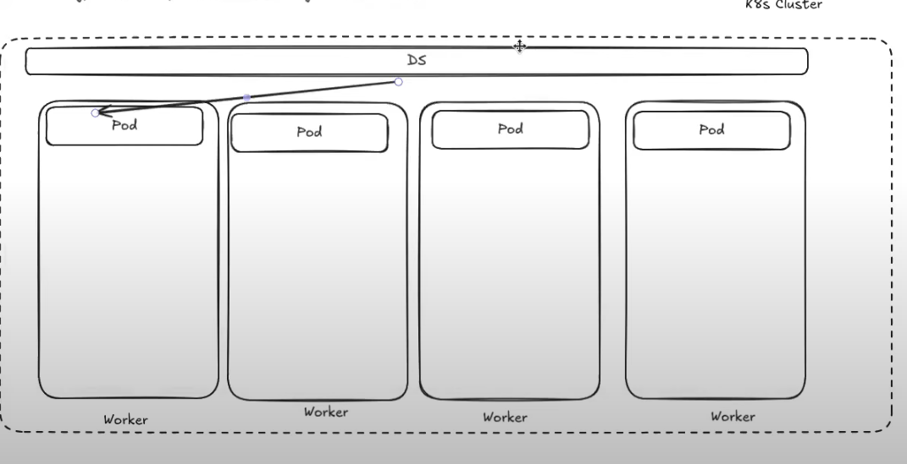

# DaemonSet (DS)

**DaemonSet** — це контролер Kubernetes, який забезпечує запуск **по одному Pod на кожній Node** (або на підмножині Node за умовами).

Типові сценарії:
- агент логування (наприклад, збір log-файлів з ноди)
- моніторинг/метрики (node exporter тощо)
- мережеві компоненти (CNI плагін), node-level проксі
- storage node-плагіни (CSI node plugin)

## Візуальна ідея



## Як це працює (коротко)

1) Ти створюєш ресурс `DaemonSet` (вказуєш `selector` і `template`).
2) Контролер DaemonSet створює Pods так, щоб **на кожній підходящій Node** був один Pod.
3) Якщо в кластер додається нова Node — DaemonSet **автоматично** створить там Pod.
4) Якщо Node зникає/стає `NotReady` — Pod на ній відповідно зникає або буде в проблемному стані.

> Важливо: Pod-и все одно фактично створюються на Node через kubelet + container runtime (як і будь-які інші Pod-и). DaemonSet просто керує тим, **де** і **скільки** таких Pod-ів має бути.

## DaemonSet vs Deployment (головна різниця)

- **Deployment**: керує кількістю реплік (N Pod-ів), Scheduler розподіляє їх по Node.
- **DaemonSet**: керує правилом “**1 Pod на Node**”, і відстежує появу/зникнення Node.

## Ключові поля

- `spec.selector`: як DaemonSet знаходить “свої” Pods (має відповідати лейблам у `template`).
- `spec.template`: Pod-шаблон, який буде запускатися.
- `spec.updateStrategy`: як оновлювати Pods (типово RollingUpdate).
- `spec.template.spec.tolerations`: часто потрібно, щоб DS запускався і на нодах з taint-ами.
- `spec.template.spec.nodeSelector/nodeAffinity`: щоб запускати DS лише на певних Node.

## Мінімальний приклад YAML

```yaml
apiVersion: apps/v1
kind: DaemonSet
metadata:
  name: node-agent
  namespace: default
spec:
  selector:
    matchLabels:
      app: node-agent
  template:
    metadata:
      labels:
        app: node-agent
    spec:
      containers:
        - name: agent
          image: busybox:1.36
          command: ["sh", "-c", "while true; do echo node-agent running; sleep 10; done"]
```

## Частий кейс: запуск і на control-plane нодах

У багатьох кластерах control-plane ноди мають **taint** ("відштовхуюче правило" для Pod-ів), наприклад:
- `node-role.kubernetes.io/control-plane:NoSchedule`

Щоб DaemonSet міг там запускатися, додають toleration:

```yaml
spec:
  template:
    spec:
      tolerations:
        - key: "node-role.kubernetes.io/control-plane"
          operator: "Exists"
          effect: "NoSchedule"
```

### Taints & Tolerations (що це таке)

- **Taint** — це правило на **Node**, яке каже: “на цю ноду Pod-и **не можна** (або **не бажано**) планувати”, **якщо** Pod не має відповідної toleration.
- **Toleration** — це правило на **Pod**, яке каже: “я **дозволяю** собі бути запланованим на ноду з таким taint”.

Типові ефекти taint:
- `NoSchedule` — Scheduler не буде ставити нові Pod-и на ноду без toleration.
- `PreferNoSchedule` — Scheduler буде уникати, але може поставити, якщо немає кращих варіантів.
- `NoExecute` — Pod-и без toleration можуть бути **виселені** з ноди (evict) + нові не будуть ставитись.

> Які саме taint-и є у твоєму кластері — дивись через `kubectl describe node ...`.

## Корисні команди kubectl

```bash
kubectl get ds -A
kubectl describe ds <name> -n <namespace>

# Подивитись, на яких нодах є Pod-и DS
kubectl get pods -n <namespace> -l app=node-agent -o wide

# Подивитись події/причини, якщо DS не створює Pod-и
kubectl describe ds <name> -n <namespace>

# Примусово “перезапустити” агент на ноді (Pod відновиться автоматично)
kubectl delete pod -n <namespace> -l app=node-agent

# Статус rollout при оновленнях
kubectl rollout status ds/<name> -n <namespace>
```

## Нотатки

- DaemonSet не “прив’язує” Pod назавжди до Node вручну — він просто забезпечує бажаний стан (по одному Pod на Node).
- Щоб DS працював тільки на частині Node, комбінують `nodeSelector` / `nodeAffinity` та/або tolerations.

## Посилання

- https://kubernetes.io/docs/concepts/workloads/controllers/daemonset/
