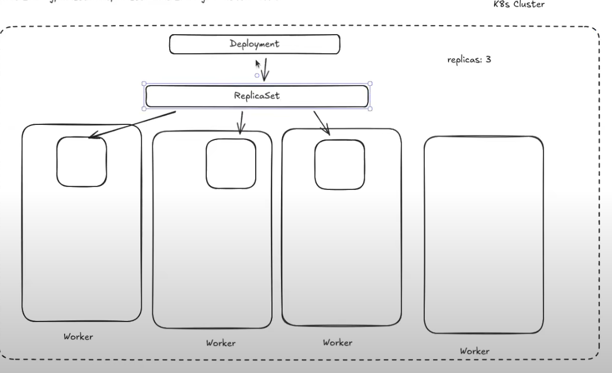

# Deployment і ReplicaSet

## Коротко

- **Deployment** — контролер для керування “версіями” застосунку і **rolling update / rollback**.
- **ReplicaSet** — контролер, який забезпечує потрібну кількість реплік Pod-ів: `replicas: N`.

Зазвичай ти **створюєш Deployment**, а **ReplicaSet створюється автоматично** всередині (Deployment ним керує).

## Візуальна ідея



## Як це працює

1) Ти застосовуєш `Deployment` з `spec.replicas` і `spec.template`.
2) Deployment створює (або оновлює) **ReplicaSet**.
3) ReplicaSet створює потрібну кількість **Pod-ів**.
4) Scheduler розкладає Pod-и по Node (з урахуванням constraints: ресурси, affinity, taints/tolerations).

## Навіщо потрібен ReplicaSet, якщо є Deployment?

Deployment відповідає за **стратегію оновлення** і “історію” змін, а ReplicaSet — за **підтримання кількості реплік** конкретної версії Pod-шаблону.

Під час оновлення образу Deployment може:
- створити **новий** ReplicaSet для нової версії
- поступово збільшувати його кількість
- і паралельно зменшувати старий ReplicaSet

## Ключові поля Deployment

- `spec.replicas`: скільки Pod-ів має працювати.
- `spec.selector.matchLabels`: як Deployment/ReplicaSet знаходить “свої” Pods (має відповідати лейблам у `template`).
- `spec.template`: Pod-шаблон (контейнери, env, volumes, probes тощо).
- `spec.strategy.type`: зазвичай `RollingUpdate`.
- `spec.strategy.rollingUpdate.maxSurge` / `maxUnavailable`: як агресивно робити rollout.

## Мінімальний приклад YAML

```yaml
apiVersion: apps/v1
kind: Deployment
metadata:
  name: web
  namespace: default
spec:
  replicas: 3
  selector:
    matchLabels:
      app: web
  template:
    metadata:
      labels:
        app: web
    spec:
      containers:
        - name: web
          image: nginx:1.27
          ports:
            - containerPort: 80
```

## Оновлення (rolling update) — приклад

Зміна `image` в `spec.template` створить новий ReplicaSet і запустить rollout:

```bash
kubectl set image deploy/web web=nginx:1.28
kubectl rollout status deploy/web
kubectl rollout history deploy/web
```

Rollback (повернутись на попередню версію):

```bash
kubectl rollout undo deploy/web
```

## Корисні команди kubectl

```bash
kubectl get deploy -A
kubectl describe deploy <name> -n <namespace>

kubectl get rs -n <namespace>
kubectl describe rs <name> -n <namespace>

kubectl get pods -n <namespace> -l app=web -o wide

# Подивитись, які RS належать Deployment
kubectl get rs -n <namespace> -o wide

# Масштабування
kubectl scale deploy/web -n default --replicas=5
```

## Нотатки

- Якщо ти видалиш Pod з ReplicaSet — ReplicaSet створить новий Pod, щоб повернутись до `replicas`.
- Якщо ти хочеш “1 Pod на кожній Node” — це вже **DaemonSet**, а не Deployment.

## Посилання

- Deployment: https://kubernetes.io/docs/concepts/workloads/controllers/deployment/
- ReplicaSet: https://kubernetes.io/docs/concepts/workloads/controllers/replicaset/
