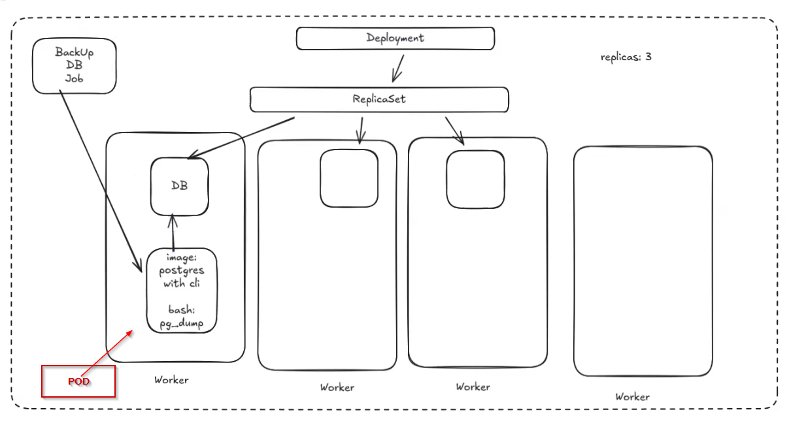

# Job

**Job** — це контролер Kubernetes для запуску **batch/одноразової роботи**: він створює Pod(и) і гарантує, що задача завершиться **успішно задану кількість разів**.

Типові кейси:
- міграції БД, одноразові скрипти
- бек-апи
- генерація/імпорт даних
- короткі утиліти/воркери, які мають завершитися

## Візуальна ідея



## Як це працює

1) Ти створюєш `Job` з `spec.template` (це Pod template).
2) Job створює Pod(и) і стежить за їх завершенням.
3) Коли Pod завершується з `exit code 0`, Job вважає це успіхом.
4) Якщо Pod падає, Job може перезапустити Pod (залежно від `backoffLimit` та `restartPolicy`).

> Важливо: `restartPolicy` у Job зазвичай `OnFailure` або `Never`.

## Ключові поля Job

- `spec.template`: Pod-шаблон (контейнери/команди/env/volumes тощо).
- `spec.completions`: скільки **успішних завершень** потрібно.
- `spec.parallelism`: скільки Pod-ів можуть виконуватися **паралельно**.
- `spec.backoffLimit`: скільки разів дозволено “провалів” перед тим як Job стане `Failed`.
- `spec.activeDeadlineSeconds`: максимально допустимий час виконання.
- `spec.ttlSecondsAfterFinished`: (опційно) авто-видалення Job після завершення.

## Мінімальний приклад YAML

```yaml
apiVersion: batch/v1
kind: Job
metadata:
  name: hello-job
spec:
  backoffLimit: 2
  template:
    spec:
      restartPolicy: Never
      containers:
        - name: hello
          image: busybox:1.36
          command: ["sh", "-c", "echo Hello from Job; sleep 2"]
```

## Корисні команди kubectl

```bash
kubectl get job -A
kubectl describe job <name> -n <namespace>

kubectl get pods -n <namespace> -l job-name=<job-name> -o wide
kubectl logs -n <namespace> -l job-name=<job-name>

# Видалити Job (і його Pod-и)
kubectl delete job <name> -n <namespace>
```

## Нотатки

- Job — це не “постійний сервіс”. Якщо тобі треба довго-живучий застосунок — це `Deployment`.
- Якщо треба запускати Job по розкладу — це `CronJob`.

## Посилання

- https://kubernetes.io/docs/concepts/workloads/controllers/job/
