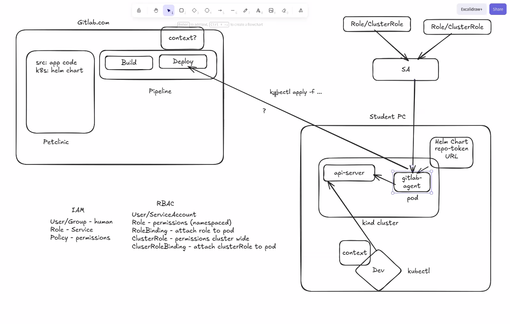

# RBAC (Role-Based Access Control)

RBAC в Kubernetes відповідає на питання: **хто** і **що саме** може робити в API Kubernetes.

Твій короткий список (ідея):
- User / ServiceAccount
- Role — permissions в namespace
- RoleBinding — прив’язати Role до ServiceAccount/User/Group
- ClusterRole — permissions cluster-wide
- ClusterRoleBinding — прив’язати ClusterRole до ServiceAccount/User/Group

## Хто такий User і що таке ServiceAccount

- **User** — “зовнішній” користувач (людина/CI), який автентифікується в кластер (cert/OIDC тощо). Kubernetes не зберігає Users як об’єкти в etcd.
- **ServiceAccount (SA)** — Kubernetes-об’єкт **в namespace**, який представляє “identity” для Pod-ів/процесів усередині кластера.

Важливо:
- Pod **не має ролі напряму**.
- Pod використовує **ServiceAccount** через `spec.serviceAccountName`.
- Права даються **ServiceAccount** через RoleBinding / ClusterRoleBinding.

## Role vs ClusterRole

- **Role** — правила доступу в межах **конкретного namespace**.
- **ClusterRole** — правила доступу:
  - або до **cluster-scoped** ресурсів (наприклад Nodes),
  - або як “загальна роль”, яку можна прив’язати і в namespace (через RoleBinding).

## RoleBinding vs ClusterRoleBinding

- **RoleBinding** (namespaced) — прив’язує **Role або ClusterRole** до суб’єкта (User/Group/ServiceAccount) **в межах одного namespace**.
- **ClusterRoleBinding** (cluster-wide) — прив’язує **ClusterRole** до суб’єкта **на весь кластер**.

## Приклад 1: дати ServiceAccount право читати Pods у namespace

### 1) ServiceAccount

```yaml
apiVersion: v1
kind: ServiceAccount
metadata:
  name: app-sa
  namespace: default
```

### 2) Role (тільки читання pods)

```yaml
apiVersion: rbac.authorization.k8s.io/v1
kind: Role
metadata:
  name: pod-reader
  namespace: default
rules:
  - apiGroups: [""]
    resources: ["pods"]
    verbs: ["get", "list", "watch"]
```

### 3) RoleBinding (прив’язати Role до SA)

```yaml
apiVersion: rbac.authorization.k8s.io/v1
kind: RoleBinding
metadata:
  name: pod-reader-to-app-sa
  namespace: default
subjects:
  - kind: ServiceAccount
    name: app-sa
    namespace: default
roleRef:
  apiGroup: rbac.authorization.k8s.io
  kind: Role
  name: pod-reader
```

### 4) Pod, який використовує SA

```yaml
apiVersion: v1
kind: Pod
metadata:
  name: demo
  namespace: default
spec:
  serviceAccountName: app-sa
  containers:
    - name: c
      image: busybox:1.36
      command: ["sh", "-c", "sleep 3600"]
```

## Приклад 2: ClusterRole + ClusterRoleBinding (кластерні права)

Наприклад, дозволити читати Nodes (Nodes — cluster-scoped ресурс):

```yaml
apiVersion: rbac.authorization.k8s.io/v1
kind: ClusterRole
metadata:
  name: node-reader
rules:
  - apiGroups: [""]
    resources: ["nodes"]
    verbs: ["get", "list", "watch"]
---
apiVersion: rbac.authorization.k8s.io/v1
kind: ClusterRoleBinding
metadata:
  name: node-reader-to-app-sa
subjects:
  - kind: ServiceAccount
    name: app-sa
    namespace: default
roleRef:
  apiGroup: rbac.authorization.k8s.io
  kind: ClusterRole
  name: node-reader
```

## Як перевіряти права

```bash
# Перевірка “чи можна” (зручно для дебагу)
kubectl auth can-i get pods -n default

# Імітувати конкретний service account
kubectl auth can-i get pods -n default --as=system:serviceaccount:default:app-sa

# Подивитись bindings
kubectl get rolebinding -n default
kubectl get clusterrolebinding

kubectl describe rolebinding pod-reader-to-app-sa -n default
kubectl describe clusterrolebinding node-reader-to-app-sa
```

## Часті помилки

- Role/RoleBinding створили, але Pod все одно не має доступу:
  - Pod використовує **інший** ServiceAccount (або default)
  - RoleBinding в іншому namespace
  - `roleRef` вказує неіснуючу роль
- Занадто широкі права ("*" у verbs/resources) — краще мінімізувати.

## Скрін-схема



## Посилання

- RBAC: https://kubernetes.io/docs/reference/access-authn-authz/rbac/
- ServiceAccounts: https://kubernetes.io/docs/concepts/security/service-accounts/
