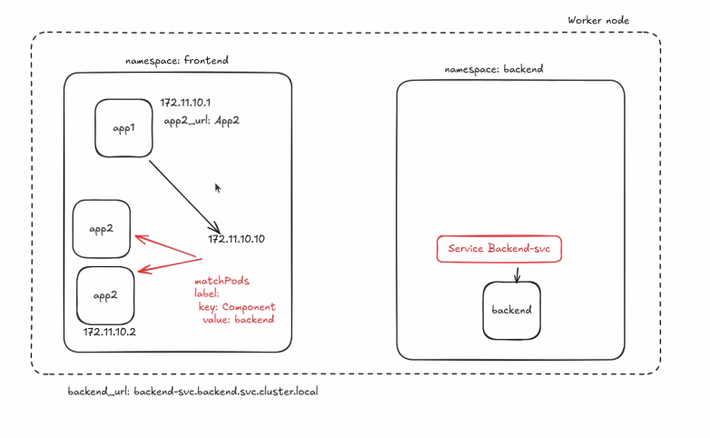
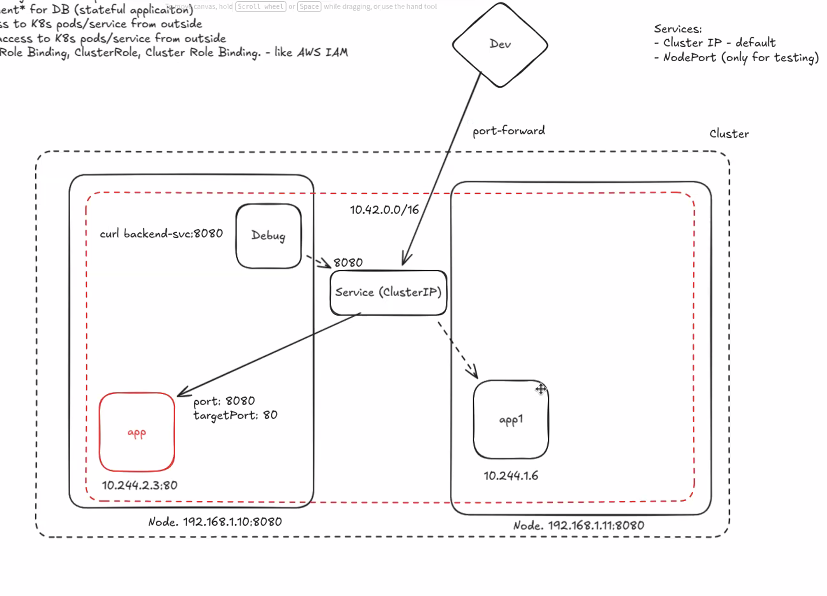

# Документація про Service у Kubernetes

## Опис
Service — це Kubernetes-об’єкт, який надає стабільну мережеву адресу (DNS/віртуальну IP) для доступу до набору Pod’ів. Service знаходить потрібні Pod’и за допомогою `selector` (labels) та балансуватиме трафік між ними.

## Навіщо потрібен Service
- Pod’и мають нестабільні IP (можуть змінюватися при перезапуску)
- Потрібна стабільна точка доступу до застосунку
- Балансування навантаження між репліками
- Відокремлення клієнтів від деталей розміщення Pod’ів

## Основні типи Service
- `ClusterIP` (за замовчуванням): доступ лише всередині кластера
- `NodePort`: відкриває порт на кожному вузлі (node) для доступу ззовні
- `LoadBalancer`: створює зовнішній балансувальник (у хмарі) та видає External IP
- `ExternalName`: мапить Service на зовнішнє DNS-ім’я (без selector/Endpoints)

## YAML-приклад: ClusterIP Service
```yaml
apiVersion: v1
kind: Service
metadata:
  name: example-service
spec:
  type: ClusterIP
  selector:
    app: example
  ports:
    - name: http
      port: 80
      targetPort: 8080
```

## YAML-приклад: NodePort Service
```yaml
apiVersion: v1
kind: Service
metadata:
  name: example-service-nodeport
spec:
  type: NodePort
  selector:
    app: example
  ports:
    - name: http
      port: 80
      targetPort: 8080
      nodePort: 30080
```

## YAML-приклад: LoadBalancer Service
```yaml
apiVersion: v1
kind: Service
metadata:
  name: example-service-lb
spec:
  type: LoadBalancer
  selector:
    app: example
  ports:
    - name: http
      port: 80
      targetPort: 8080
```

## Важливі поля
- `spec.selector`: labels Pod’ів, на які буде спрямовано трафік
- `spec.ports.port`: порт Service (клієнти підключаються до нього)
- `spec.ports.targetPort`: порт у контейнері/Pod’і
- `spec.type`: спосіб експонування Service

## Як Service знаходить Pod’и (selector → endpoints)
Service “підбирає” цільові Pod’и за `spec.selector` (labels). За цим selector Kubernetes формує **Endpoints/EndpointSlice** — список IP/портів Pod’ів, куди реально піде трафік.

Важливо:
- Selector працює **тільки в межах одного namespace** (Service не може напряму вибрати Pod’и з іншого namespace).

## Доступ між namespace (DNS)
Pod з `frontend` може звертатись до Service в `backend` через DNS:
- повне ім’я: `backend-svc.backend.svc.cluster.local`
- часто вистачає: `backend-svc.backend`

## Схема (скріншот)


## Основні команди kubectl
- Переглянути services: `kubectl get svc -n <namespace>`
- Деталі service: `kubectl describe svc <service-name> -n <namespace>`
- Переглянути endpoints: `kubectl get endpoints -n <namespace>`
- Видалити service: `kubectl delete svc <service-name> -n <namespace>`

## Перевірка доступності (локально)
- Port-forward до Service: `kubectl port-forward svc/<service-name> 8080:80 -n <namespace>`

## Схема (ClusterIP + port-forward)


## Додатково
Докладніше: https://kubernetes.io/docs/concepts/services-networking/service/
