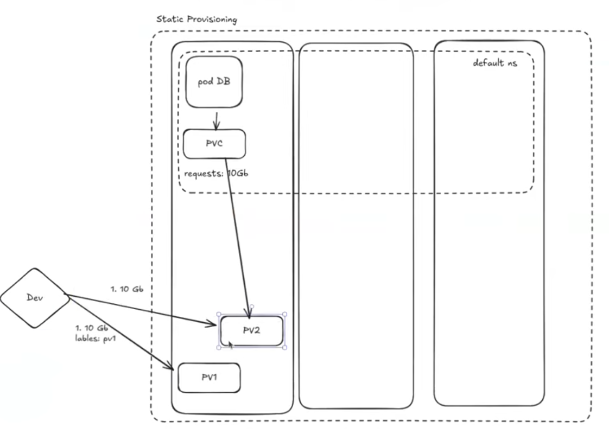
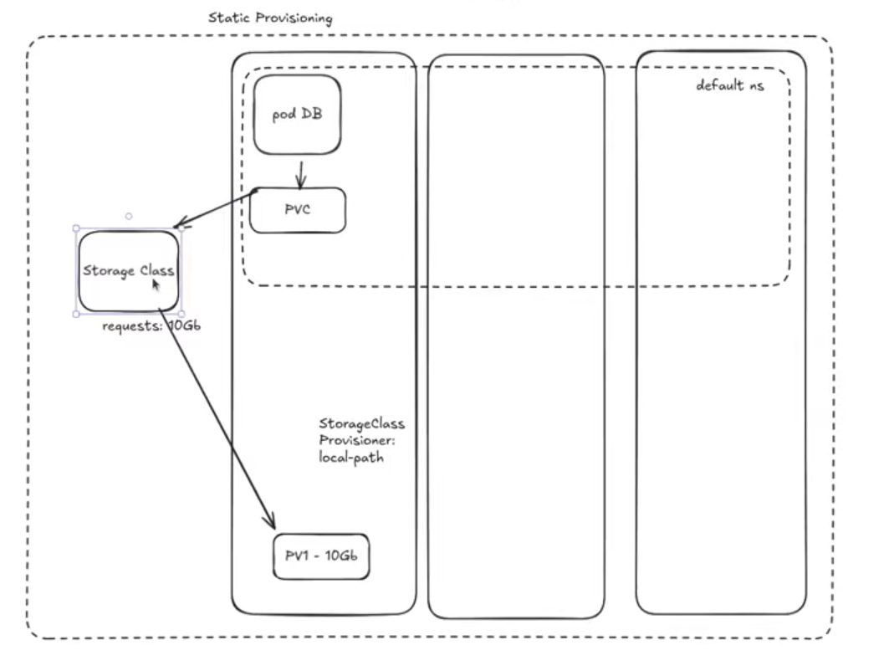
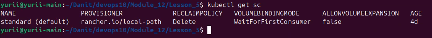

# StorageClass

**StorageClass** — це опис “класу” сховища в Kubernetes: *який тип диска/тома створювати і з якими параметрами*.

Ключова ідея:
- Pod зазвичай не просить диск напряму.
- Pod використовує **PVC** (PersistentVolumeClaim).
- PVC посилається на **StorageClass**.
- Далі або:
  - **динамічно** створюється PV (через provisioner), або
  - використовується **вже існуючий** PV (статичне provision).

## Де StorageClass в “ланцюжку”

`Pod → PVC → StorageClass → (динамічно створений) PV → реальний диск/том`

## Чи треба спочатку створювати PV?

Не завжди.

- **Dynamic provisioning (найчастіше в cloud/CSI)**: ти створюєш **StorageClass + PVC** (і Pod, який використовує PVC). PV створиться **автоматично** драйвером (provisioner). Тобто **PV вручну створювати не треба**.
- **Static provisioning**: ти спочатку створюєш **PV вручну** (описуєш існуючий диск/том), а потім створюєш **PVC**, який “підбере” відповідний PV. Тобто тут **так — PV спочатку**.

Приклад **static provisioning** (коли PV створюється вручну, а PVC “підбирає” відповідний PV):



Схема, де видно роль **StorageClass** у цьому ланцюжку:



### Якщо PV декілька: як вибирається “правильний”

Коли в кластері є **кілька PV**, які потенційно підходять, Kubernetes робить **binding** (прив’язку) PVC → PV за правилами сумісності:
- `storageClassName` (має збігатися або бути сумісним з тим, що просить PVC)
- `accessModes` (наприклад, `ReadWriteOnce`)
- розмір: PV має бути **не менший**, ніж `requests.storage` у PVC
- додаткові обмеження, якщо ти їх задаєш

Щоб **керувати вибором** PV при static provisioning, найпростіший спосіб — поставити PV **лейбли** і в PVC вказати `spec.selector`.

Приклад: PV має лейбл `disk=fast`, а PVC просить саме такий PV:

```yaml
apiVersion: v1
kind: PersistentVolumeClaim
metadata:
  name: app-data
spec:
  accessModes: ["ReadWriteOnce"]
  resources:
    requests:
      storage: 10Gi
  storageClassName: local-storage
  selector:
    matchLabels:
      disk: fast
```

Після успішного binding PV стає **занятим** (у PV з’являється `claimRef`), і цей PV вже не буде виданий іншому PVC.

## Навіщо потрібен StorageClass

- стандартизувати “яке сховище” для різних застосунків (fast/slow, ssd/hdd)
- увімкнути **dynamic provisioning** (PV створюється автоматично)
- керувати:
  - `reclaimPolicy` (що робити з PV/диском після видалення PVC)
  - `volumeBindingMode` (коли прив’язувати PV до ноди)
  - `allowVolumeExpansion` (чи можна збільшувати)

## `reclaimPolicy` (дуже важливо)

`reclaimPolicy` визначає, що буде з **PersistentVolume (PV)** і (залежно від типу сховища) з **реальним диском/томом** після того, як ти видалиш **PVC**.

Два основні варіанти:

- `Delete` — після видалення PVC Kubernetes (через provisioner) видалить **PV** і зазвичай також **реальний том/диск**.
  - Плюс: не залишає “сміття” зі старих томів.
  - Мінус: якщо видалити PVC помилково — можна втратити дані.

- `Retain` — після видалення PVC **PV зберігається** (зазвичай переходить у стан на кшталт “Released”), і реальний диск теж не видаляється.
  - Плюс: безпечніше для важливих даних.
  - Мінус: потрібно вручну прибирати/переприв’язувати ресурси (очистка даних, видалення PV/диска).

> Нотатка: раніше існувала опція `Recycle`, але її в сучасних кластерах зазвичай вже не використовують.

Практичне правило:
- для тестових/тимчасових даних часто ок — `Delete`
- для критичних баз даних — частіше хочуть `Retain` (або контрольований бекап/restore процес)

## Ключові поля

- `provisioner`: який драйвер створює томи (залежить від платформи/CSI).
  - приклади: cloud/CSI драйвери; для local static часто `kubernetes.io/no-provisioner`
- `parameters`: параметри конкретного provisioner (різні для різних драйверів).
- `reclaimPolicy`:
  - `Delete` — після видалення PVC диск/том буде видалений (часто дефолт у cloud).
  - `Retain` — диск збережеться, потрібно чистити вручну.
- `volumeBindingMode`:
  - `Immediate` — PV створюється/прив’язується одразу.
  - `WaitForFirstConsumer` — PV прив’язується тільки коли з’явиться Pod, який буде використовувати PVC (зручно, щоб врахувати topology/zone).
- `allowVolumeExpansion`: дозволити збільшення PVC (якщо драйвер це підтримує).

## Як вибирається StorageClass (default)

- Якщо в PVC **не вказати** `storageClassName`, Kubernetes може підставити **default StorageClass**.
- Default визначається анотацією на StorageClass:

```yaml
metadata:
  annotations:
    storageclass.kubernetes.io/is-default-class: "true"
```

## Приклад StorageClass (local/static сценарій)

Це не створює PV автоматично, але корисно у кластерах з local volumes.

```yaml
apiVersion: storage.k8s.io/v1
kind: StorageClass
metadata:
  name: local-storage
provisioner: kubernetes.io/no-provisioner
volumeBindingMode: WaitForFirstConsumer
reclaimPolicy: Retain
```

## Приклад PVC, який використовує StorageClass

```yaml
apiVersion: v1
kind: PersistentVolumeClaim
metadata:
  name: app-data
spec:
  accessModes:
    - ReadWriteOnce
  resources:
    requests:
      storage: 10Gi
  storageClassName: local-storage
```

> Примітка: для реальної роботи ще потрібен PV (статично) або provisioner (динамічно).

## Корисні команди kubectl

```bash
# StorageClass
kubectl get storageclass
kubectl describe storageclass <name>

# PVC/PV
kubectl get pvc -A
kubectl describe pvc <name> -n <namespace>

kubectl get pv
kubectl describe pv <name>

# Дивитись події, якщо PVC не прив’язується
kubectl describe pvc <name> -n <namespace>
```

Приклад виводу `kubectl get sc`:



Коротко про колонки:
- **NAME** — назва StorageClass (мітка `(default)` означає default StorageClass).
- **PROVISIONER** — який драйвер створює томи (у твоєму прикладі `rancher.io/local-path`).
- **RECLAIMPOLICY** — що буде з PV/томом після видалення PVC (`Delete` або `Retain`).
- **VOLUMEBINDINGMODE** — коли робиться binding (`Immediate` або `WaitForFirstConsumer`).
- **ALLOWVOLUMEEXPANSION** — чи дозволено збільшувати розмір PVC.

## Типові питання/помилки

- PVC в статусі `Pending`:
  - немає default StorageClass і не вказано `storageClassName`, або
  - provisioner не працює/не встановлений, або
  - для `WaitForFirstConsumer` ще немає Pod, який використовує PVC.
- `Retain` vs `Delete`:
  - `Delete` зручно, але для важливих даних часто краще `Retain`, щоб випадково не стерти диск.

## Посилання

- https://kubernetes.io/docs/concepts/storage/storage-classes/
- https://kubernetes.io/docs/concepts/storage/persistent-volumes/
